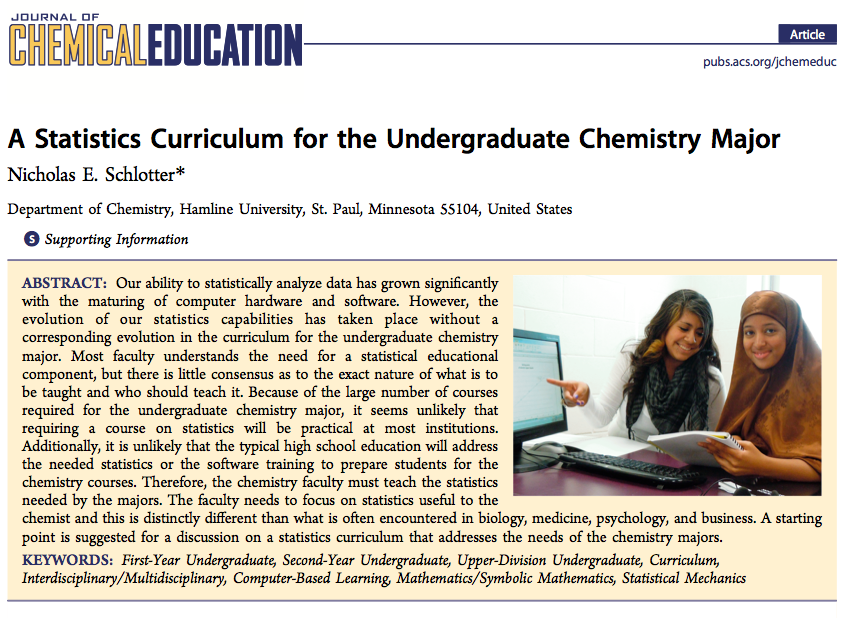

Context
-------

I teach at a 4-year liberal arts college in which 

 * roughly half of the students graduate with a professional degree 
(engineering, nursing, education, speach pathology, etc.)

 * the sciences are strongly represented ($\sim 25\%$ and growing)
 
 * statistics required for biology and engineering (dedicated 
 courses for each), and for computer science, 
 but not for physics and chemistry 

Some History
---

  0. Biology asks for feedback on math/stat in lab manual
    * not a physical science, but got the ball rolling
    * also teach *Intro Biostats*
  1. Physics asks for feedback on their data analysis manual
    * has led to periodic conversation bursts
  2. Creation of new Stats course for Engineers
    * 2-hour required course, spring sophomore year
    * taught for 2 years by colleague, 2 years by me
  3. Creation of home-brewed materials to teach engineers
    * used this spring for second time
  4. Interaction with 2 engineers about topics, data, etc.

The odd place of statistics in the sciences
---

 * the more a science uses data and the more mathematics
 their students take, the less likely they are to take 
 a college statistics course
 
 * regardless of the amount of statistics a program wants 
 its students to know, the maximal dose is 1 course
    * less than a course is preferable

 * everyone (a) complains about their lack of statistical background,
 and (b) thinks they can teach statistics
 
 * statistical idiosynchrasies (a.k.a. culture) grow up
 within disciplines (including Stat Ed)

Intro Stats is part of the problem, not part of the solution
---
An ~~obvious~~ wrong solution: have the scientists take 
Intro Stats

 * for all the attention statisticians have placed 
 on Intro Stats, most physical scientists
 would be sorely disappointed to have their students spend
 an entire semester to learn what is in those courses.
 
   
We need to talk 
---

We need to talk -- and listen
---

The customer is not always right
---

 * scientific communities may perpetuate statistical errors or misconceptions
 
 * scientists are often unaware of statistical options
    + *a* way becomes *the* way
 
 * (most) scientists have no real experience teaching statistics
    + don't know what concepts are challenging
    + don't always appreciate prerequisite understanding
    + don't know current trends in Stat Ed
    + may not appreciate difference between doing and understanding

The customer is not always wrong
---

> I believe sanity and realism can be restored to the teaching of Mathematical Statistics most easily and directly by entrusting such teaching largely to men and women who have had personal experience of research in the Natural Sciences.

\pause
\hfill 

\hfill -- [R. A. Fisher](http://www.brainyquote.com/quotes/authors/r/ronald_fisher.html#3pSOAd5TuQTl7U5h.99)

Fisher isn't the only one
---

 

Fisher isn't the only one
---

[A Statistics Curriculum for the Undergraduate Chemistry Major](http://pubs.acs.org/doi/full/10.1021/ed300334e)

Schlotter, J. Chem. Educ., 2013, 90 (1), pp 51–55

 * the **chemistry community needs to** have a discussion about statistics and to **decide what statistics should be taught**
 * statistics curriculum needs to be **embedded in chemistry courses**
 * to require a course in probability and statistics reaches the breaking point for required courses 
 * even when students take a statistics course in the mathematics 
 department, it **does not address many of the needs** of chemistry majors 
 * focusing on how to **test data relative to a model**
 * using **Excel** to do calculations and plot results

The customer is not always wrong
---

What the scientist knows

 * science -- context matters
 
 \pause
 
 * how statistics is (or could be) used in science courses/labs/research
 
 \pause
 
 * a (subset of) important statistical applications
 
 \pause
 
 * what things we do that are of no use to them
 
So what do the engineers want?
---

I asked, and they said this:
\begin{figure}
    \centering
    \Oldincludegraphics[width=.75\textwidth]{HXerFig.pdf}
    \caption{Heat exchanger with statepoints.}
    \label{fig:HXer_Figure}
\end{figure}

So what do the engineers want?
---
\hfill\Oldincludegraphics[width=.30\textwidth]{HXerFig.pdf}
\vspace*{-1.0in}

\begin{eqnarray*}
    U &=& \frac{\dot{Q}}{A \Delta T_{lm}}
    \\
    \dot{Q} &=& \dot{m}_{1} C_{p} (T_{2} - T_{1})
    \\
    \Delta T_{lm} &=& \frac{(T_{1} - T_{4}) - (T_{2} - T_{3})}
    {\log\left( \frac{T_{1} - T_{4}}{T_{2} - T_{3}} \right)}
\end{eqnarray*}

\pause
Estimate $U$ with uncertainty

\pause
Oh, and $n = 1$.

A simpler problem
---
Given a bag of dimes, how can we estmate the number of dimes
without counting them all?  How accurate is such an estimate?

 * What would an Intro Stats student do with this?
 \pause
 
    + collect a sample of bags of dimes
    + weigh each bag, and count dimes in each bag
    + fit a linear regression

Where do numbers come from?
---
Given a bag of dimes, how can we estmate the number of dimes
without counting them all?  How accurate is such an estimate?

$$
N = \frac{ T }{ \overline{d} }
$$

 * uncertainty in $\overline{d}$: $\frac{s}{\sqrt{n}}$
 
 * uncertainty in $T$ depends on measuring device and protocol
 
 * uncertainty in $N$ depends on
 
    * two uncertainties above
    
    * division

Another Example: Spectrophotometry
--

Spectrophotometry
---
 1. prepare several dilutions of a standard solution (`conc`)
 2. measure absorbance of each with a spectrophotometer (`abs`)
 3. should be a linear relation between the two

\centerline{\Oldincludegraphics[height=2in]{specPlot.png}}

Spectrophotometry
---
\centerline{\Oldincludegraphics[height=1in]{specPlot.png}}

for a substance with unknown `conc`, measure `abs` and use
 data to estimate `conc`

\pause

 * Which variable is the "response variable" here?

 * Does "independent variable" = "expanatory variable"?

 * How do we estimate concentration with uncertainty?

So what do we (statisticians) do?
---

 1. Find conversation partners
 
    * be prepared for a long, slow conversation
    * make sure you are really communicating (vocab!)

\pause

 2. Attack the labs
 
    * that's where data analysis happens
    * often home brewed, so change can happen more quickly

\pause

 3. Help in downstream courses
 
    * We haven't acheived much until what happens in statistics
    makes a difference in the science courses

\pause

 4. Focus on estimation with uncertainty
 
    * Let scientists help pick applications

But Wait, There's More
---

11 ET today:

\begin{center}
Cassandra Wolos Pattanayak from Wellesley College 

\medskip

Reaching Students Outside the Statistics Classroom:

\smallskip

Integrating Statistics into the Coursework and Research Experiences of Non-Statistics Majors
\end{center}